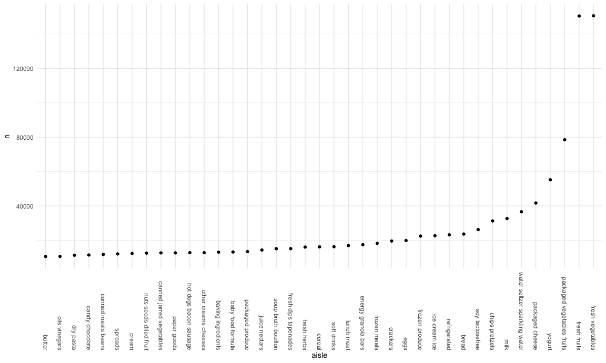

Homework 3
================
Linh Tran
10/6/2020

``` r
library(tidyverse)
```

    ## ── Attaching packages ───────────────────────────────────────────────────────────────────────────────────────────────────────── tidyverse 1.3.0 ──

    ## ✓ ggplot2 3.3.2     ✓ purrr   0.3.4
    ## ✓ tibble  3.0.3     ✓ dplyr   1.0.2
    ## ✓ tidyr   1.1.2     ✓ stringr 1.4.0
    ## ✓ readr   1.3.1     ✓ forcats 0.5.0

    ## ── Conflicts ──────────────────────────────────────────────────────────────────────────────────────────────────────────── tidyverse_conflicts() ──
    ## x dplyr::filter() masks stats::filter()
    ## x dplyr::lag()    masks stats::lag()

``` r
library(ggridges)
library(patchwork)

knitr::opts_chunk$set(
  fig.width = 12,
  fig.asp = .6,  
  fig.height = 6,
  out.width = "90%"
)

theme_set(theme_minimal() + theme(legend.position = "bottom")) 

options(
  ggplot2.continuous.colour = "viridis",
  ggplot2.continuous.fill = "viridis"
)

scale_colour_discrete = scale_color_viridis_d
scale_colour_continuous = scale_color_viridis_c
```

# Problem 1

Load the dataset

``` r
library(p8105.datasets)
data("instacart")
print(instacart)
```

    ## # A tibble: 1,384,617 x 15
    ##    order_id product_id add_to_cart_ord… reordered user_id eval_set order_number
    ##       <int>      <int>            <int>     <int>   <int> <chr>           <int>
    ##  1        1      49302                1         1  112108 train               4
    ##  2        1      11109                2         1  112108 train               4
    ##  3        1      10246                3         0  112108 train               4
    ##  4        1      49683                4         0  112108 train               4
    ##  5        1      43633                5         1  112108 train               4
    ##  6        1      13176                6         0  112108 train               4
    ##  7        1      47209                7         0  112108 train               4
    ##  8        1      22035                8         1  112108 train               4
    ##  9       36      39612                1         0   79431 train              23
    ## 10       36      19660                2         1   79431 train              23
    ## # … with 1,384,607 more rows, and 8 more variables: order_dow <int>,
    ## #   order_hour_of_day <int>, days_since_prior_order <int>, product_name <chr>,
    ## #   aisle_id <int>, department_id <int>, aisle <chr>, department <chr>

This dataset contains 1384617 rows and 15 columns.

Observations are the level of items in orders by user. There are users /
order variables – user ID, order ID, order day, and order hour. There
are also item variables – name, aisle, department, and some numeric
codes.

How many aisles, and which are most items from?

``` r
instacart %>% 
  count(aisle) %>%
  arrange(desc(n))       
```

    ## # A tibble: 134 x 2
    ##    aisle                              n
    ##    <chr>                          <int>
    ##  1 fresh vegetables              150609
    ##  2 fresh fruits                  150473
    ##  3 packaged vegetables fruits     78493
    ##  4 yogurt                         55240
    ##  5 packaged cheese                41699
    ##  6 water seltzer sparkling water  36617
    ##  7 milk                           32644
    ##  8 chips pretzels                 31269
    ##  9 soy lactosefree                26240
    ## 10 bread                          23635
    ## # … with 124 more rows

Let’s make a plot shows the number of items ordered in each aisle

``` r
instacart %>% 
  count(aisle) %>% 
  filter(n > 10000) %>% 
  mutate(
    aisle = factor(aisle),
    aisle = fct_reorder(aisle, n)
  ) %>% 
  ggplot(aes(x = aisle, y = n)) +
  geom_point() +
  theme(axis.text.x = element_text(angle = 270, vjust = 0.5, hjust = 1))
```



Let’s make a table showing the three most popular items in each of the 3
listed aisles

``` r
instacart %>% 
  filter(aisle %in% c("baking ingredients", "dog food care", "packaged vegetables fruits")) %>% 
  group_by(aisle) %>% 
  count(product_name) %>% 
  mutate(rank = min_rank(desc(n))) %>% 
  filter(rank < 4 ) %>% 
  arrange(aisle, rank) %>% 
  knitr::kable()
```

| aisle                      | product\_name                                 |    n | rank |
| :------------------------- | :-------------------------------------------- | ---: | ---: |
| baking ingredients         | Light Brown Sugar                             |  499 |    1 |
| baking ingredients         | Pure Baking Soda                              |  387 |    2 |
| baking ingredients         | Cane Sugar                                    |  336 |    3 |
| dog food care              | Snack Sticks Chicken & Rice Recipe Dog Treats |   30 |    1 |
| dog food care              | Organix Chicken & Brown Rice Recipe           |   28 |    2 |
| dog food care              | Small Dog Biscuits                            |   26 |    3 |
| packaged vegetables fruits | Organic Baby Spinach                          | 9784 |    1 |
| packaged vegetables fruits | Organic Raspberries                           | 5546 |    2 |
| packaged vegetables fruits | Organic Blueberries                           | 4966 |    3 |

Make a table showing the mean hour of the day at which Pink Lady Apple
and Coffee Ice Cream are ordred on each day of the week

``` r
instacart %>% 
  filter(product_name %in% c("Pink Lady Apples", "Coffee Ice Cream")) %>% 
  group_by(product_name, order_dow) %>% 
  summarize(mean_hour = mean(order_hour_of_day)) %>% 
  pivot_wider(
    names_from = order_dow,
    values_from = mean_hour
  )
```

    ## `summarise()` regrouping output by 'product_name' (override with `.groups` argument)

    ## # A tibble: 2 x 8
    ## # Groups:   product_name [2]
    ##   product_name       `0`   `1`   `2`   `3`   `4`   `5`   `6`
    ##   <chr>            <dbl> <dbl> <dbl> <dbl> <dbl> <dbl> <dbl>
    ## 1 Coffee Ice Cream  13.8  14.3  15.4  15.3  15.2  12.3  13.8
    ## 2 Pink Lady Apples  13.4  11.4  11.7  14.2  11.6  12.8  11.9

# Problem 2

#### Load, tidy and wrangle the accelerometer dataset

``` r
accel_df = read_csv("./data/accel_data.csv") %>% 
  pivot_longer(
    activity.1:activity.1440,
    names_to = "min_of_the_day",
    names_prefix = "activity.",
    values_to = "activity_count"
  ) %>% 
  mutate(day = factor(day),
         day = fct_relevel(day, c("Monday", "Tuesday", "Wednesday", "Thursday", "Friday", "Saturday", "Sunday"))) %>% 
  mutate(wd_or_wknd = case_when(
        day %in% c("Monday", "Tuesday", "Wednesday", "Thursday", "Friday") ~ "weekday",
        day %in% c("Saturday", "Sunday") ~ "weekend",
         TRUE ~ "")
  ) %>% 
  mutate(min_of_the_day = as.numeric(min_of_the_day),
         wd_or_wknd = factor(wd_or_wknd)
  )
```

    ## Parsed with column specification:
    ## cols(
    ##   .default = col_double(),
    ##   day = col_character()
    ## )

    ## See spec(...) for full column specifications.

``` r
accel_df
```

    ## # A tibble: 50,400 x 6
    ##     week day_id day    min_of_the_day activity_count wd_or_wknd
    ##    <dbl>  <dbl> <fct>           <dbl>          <dbl> <fct>     
    ##  1     1      1 Friday              1           88.4 weekday   
    ##  2     1      1 Friday              2           82.2 weekday   
    ##  3     1      1 Friday              3           64.4 weekday   
    ##  4     1      1 Friday              4           70.0 weekday   
    ##  5     1      1 Friday              5           75.0 weekday   
    ##  6     1      1 Friday              6           66.3 weekday   
    ##  7     1      1 Friday              7           53.8 weekday   
    ##  8     1      1 Friday              8           47.8 weekday   
    ##  9     1      1 Friday              9           55.5 weekday   
    ## 10     1      1 Friday             10           43.0 weekday   
    ## # … with 50,390 more rows

#### Aggregate across minutes to create a total activity variable for each day, and create a table showing these totals. Any trends?

``` r
total_activity_table = 
  accel_df %>% 
  group_by(week, day_id, day) %>% 
  summarize(total_activity_each_day = sum(activity_count)) %>% 
  knitr::kable()
```

    ## `summarise()` regrouping output by 'week', 'day_id' (override with `.groups` argument)

``` r
accel_df %>% 
  group_by(week, day_id, day) %>% 
  summarize(total_activity_each_day = sum(activity_count)) %>% 
  pivot_wider(
    names_from = day,
    values_from = total_activity_each_day) %>% 
   knitr::kable(digit = 1)
```

    ## `summarise()` regrouping output by 'week', 'day_id' (override with `.groups` argument)

| week | day\_id |   Friday |   Monday | Saturday | Sunday | Thursday |  Tuesday | Wednesday |
| ---: | ------: | -------: | -------: | -------: | -----: | -------: | -------: | --------: |
|    1 |       1 | 480542.6 |       NA |       NA |     NA |       NA |       NA |        NA |
|    1 |       2 |       NA |  78828.1 |       NA |     NA |       NA |       NA |        NA |
|    1 |       3 |       NA |       NA |   376254 |     NA |       NA |       NA |        NA |
|    1 |       4 |       NA |       NA |       NA | 631105 |       NA |       NA |        NA |
|    1 |       5 |       NA |       NA |       NA |     NA | 355923.6 |       NA |        NA |
|    1 |       6 |       NA |       NA |       NA |     NA |       NA | 307094.2 |        NA |
|    1 |       7 |       NA |       NA |       NA |     NA |       NA |       NA |    340115 |
|    2 |       8 | 568839.0 |       NA |       NA |     NA |       NA |       NA |        NA |
|    2 |       9 |       NA | 295431.0 |       NA |     NA |       NA |       NA |        NA |
|    2 |      10 |       NA |       NA |   607175 |     NA |       NA |       NA |        NA |
|    2 |      11 |       NA |       NA |       NA | 422018 |       NA |       NA |        NA |
|    2 |      12 |       NA |       NA |       NA |     NA | 474048.0 |       NA |        NA |
|    2 |      13 |       NA |       NA |       NA |     NA |       NA | 423245.0 |        NA |
|    2 |      14 |       NA |       NA |       NA |     NA |       NA |       NA |    440962 |
|    3 |      15 | 467420.0 |       NA |       NA |     NA |       NA |       NA |        NA |
|    3 |      16 |       NA | 685910.0 |       NA |     NA |       NA |       NA |        NA |
|    3 |      17 |       NA |       NA |   382928 |     NA |       NA |       NA |        NA |
|    3 |      18 |       NA |       NA |       NA | 467052 |       NA |       NA |        NA |
|    3 |      19 |       NA |       NA |       NA |     NA | 371230.0 |       NA |        NA |
|    3 |      20 |       NA |       NA |       NA |     NA |       NA | 381507.0 |        NA |
|    3 |      21 |       NA |       NA |       NA |     NA |       NA |       NA |    468869 |
|    4 |      22 | 154049.0 |       NA |       NA |     NA |       NA |       NA |        NA |
|    4 |      23 |       NA | 409450.0 |       NA |     NA |       NA |       NA |        NA |
|    4 |      24 |       NA |       NA |     1440 |     NA |       NA |       NA |        NA |
|    4 |      25 |       NA |       NA |       NA | 260617 |       NA |       NA |        NA |
|    4 |      26 |       NA |       NA |       NA |     NA | 340291.0 |       NA |        NA |
|    4 |      27 |       NA |       NA |       NA |     NA |       NA | 319568.0 |        NA |
|    4 |      28 |       NA |       NA |       NA |     NA |       NA |       NA |    434460 |
|    5 |      29 | 620860.0 |       NA |       NA |     NA |       NA |       NA |        NA |
|    5 |      30 |       NA | 389080.0 |       NA |     NA |       NA |       NA |        NA |
|    5 |      31 |       NA |       NA |     1440 |     NA |       NA |       NA |        NA |
|    5 |      32 |       NA |       NA |       NA | 138421 |       NA |       NA |        NA |
|    5 |      33 |       NA |       NA |       NA |     NA | 549658.0 |       NA |        NA |
|    5 |      34 |       NA |       NA |       NA |     NA |       NA | 367824.0 |        NA |
|    5 |      35 |       NA |       NA |       NA |     NA |       NA |       NA |    445366 |

#### Make a single-panel plot that shows 24-hour activity time courses for each day and use color to indicate day of the week. Describe in words any patterns or conclusions you can make based on this graph

minute x-axis, activity\_count y-axis

``` r
accel_df %>%  
  ggplot(aes(x = min_of_the_day, y = activity_count, color = day)) +
  geom_line(size = 1.5, alpha = 0.5) +  
  geom_smooth(se = FALSE) +
  labs(title = "24-hour activity time courses")
```

    ## `geom_smooth()` using method = 'gam' and formula 'y ~ s(x, bs = "cs")'


# Problem 3

Load the NY NOAA dataset

``` r
library(p8105.datasets)
data("ny_noaa")
```

The dataset has 7 variables, specifically *id, date, prcp, snow, snwd,
tmax, tmin* and 2595176 observations.

#### Data cleaning

``` r
ny_noaa_tidy = 
  ny_noaa %>% 
  separate(date, into = c("year", "month", "day"), convert = TRUE)

ny_noaa_tidy
```

    ## # A tibble: 2,595,176 x 9
    ##    id           year month   day  prcp  snow  snwd tmax  tmin 
    ##    <chr>       <int> <int> <int> <int> <int> <int> <chr> <chr>
    ##  1 US1NYAB0001  2007    11     1    NA    NA    NA <NA>  <NA> 
    ##  2 US1NYAB0001  2007    11     2    NA    NA    NA <NA>  <NA> 
    ##  3 US1NYAB0001  2007    11     3    NA    NA    NA <NA>  <NA> 
    ##  4 US1NYAB0001  2007    11     4    NA    NA    NA <NA>  <NA> 
    ##  5 US1NYAB0001  2007    11     5    NA    NA    NA <NA>  <NA> 
    ##  6 US1NYAB0001  2007    11     6    NA    NA    NA <NA>  <NA> 
    ##  7 US1NYAB0001  2007    11     7    NA    NA    NA <NA>  <NA> 
    ##  8 US1NYAB0001  2007    11     8    NA    NA    NA <NA>  <NA> 
    ##  9 US1NYAB0001  2007    11     9    NA    NA    NA <NA>  <NA> 
    ## 10 US1NYAB0001  2007    11    10    NA    NA    NA <NA>  <NA> 
    ## # … with 2,595,166 more rows

Last part: use `patchwork`

#### Make a two-panel plot the average

x = tmin, y = tmax
