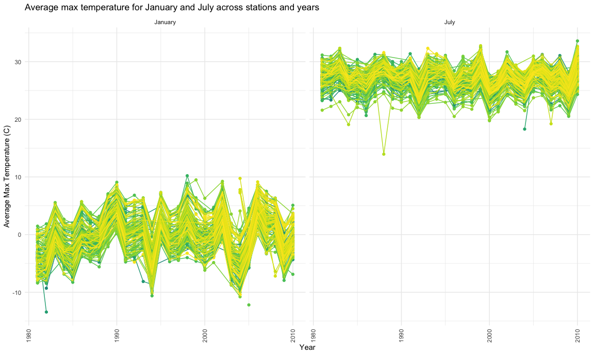

Homework 3
================
Linh Tran
10/6/2020

``` r
library(tidyverse)
```

    ## ── Attaching packages ────────────────────────────────────────────────────────────────────────────────────────── tidyverse 1.3.0 ──

    ## ✓ ggplot2 3.3.2     ✓ purrr   0.3.4
    ## ✓ tibble  3.0.3     ✓ dplyr   1.0.2
    ## ✓ tidyr   1.1.2     ✓ stringr 1.4.0
    ## ✓ readr   1.3.1     ✓ forcats 0.5.0

    ## ── Conflicts ───────────────────────────────────────────────────────────────────────────────────────────── tidyverse_conflicts() ──
    ## x dplyr::filter() masks stats::filter()
    ## x dplyr::lag()    masks stats::lag()

``` r
library(ggridges)
library(patchwork)

knitr::opts_chunk$set(
  fig.width = 12,
  fig.asp = .6,  
  fig.height = 6,
  out.width = "90%"
)

theme_set(theme_minimal() + theme(legend.position = "bottom")) 

options(
  ggplot2.continuous.colour = "viridis",
  ggplot2.continuous.fill = "viridis"
)

scale_colour_discrete = scale_color_viridis_d
scale_colour_continuous = scale_color_viridis_c
```

# Problem 1

Load the dataset

``` r
library(p8105.datasets)
data("instacart")
print(instacart)
```

    ## # A tibble: 1,384,617 x 15
    ##    order_id product_id add_to_cart_ord… reordered user_id eval_set order_number
    ##       <int>      <int>            <int>     <int>   <int> <chr>           <int>
    ##  1        1      49302                1         1  112108 train               4
    ##  2        1      11109                2         1  112108 train               4
    ##  3        1      10246                3         0  112108 train               4
    ##  4        1      49683                4         0  112108 train               4
    ##  5        1      43633                5         1  112108 train               4
    ##  6        1      13176                6         0  112108 train               4
    ##  7        1      47209                7         0  112108 train               4
    ##  8        1      22035                8         1  112108 train               4
    ##  9       36      39612                1         0   79431 train              23
    ## 10       36      19660                2         1   79431 train              23
    ## # … with 1,384,607 more rows, and 8 more variables: order_dow <int>,
    ## #   order_hour_of_day <int>, days_since_prior_order <int>, product_name <chr>,
    ## #   aisle_id <int>, department_id <int>, aisle <chr>, department <chr>

This dataset contains 1384617 rows and 15 columns.

Observations are the level of items in orders by user. There are users /
order variables – user ID, order ID, order day, and order hour. There
are also item variables – name, aisle, department, and some numeric
codes.

How many aisles, and which are most items from?

``` r
instacart %>% 
  count(aisle) %>%
  arrange(desc(n))       
```

    ## # A tibble: 134 x 2
    ##    aisle                              n
    ##    <chr>                          <int>
    ##  1 fresh vegetables              150609
    ##  2 fresh fruits                  150473
    ##  3 packaged vegetables fruits     78493
    ##  4 yogurt                         55240
    ##  5 packaged cheese                41699
    ##  6 water seltzer sparkling water  36617
    ##  7 milk                           32644
    ##  8 chips pretzels                 31269
    ##  9 soy lactosefree                26240
    ## 10 bread                          23635
    ## # … with 124 more rows

Let’s make a plot shows the number of items ordered in each aisle

``` r
instacart %>% 
  count(aisle) %>% 
  filter(n > 10000) %>% 
  mutate(
    aisle = factor(aisle),
    aisle = fct_reorder(aisle, n)
  ) %>% 
  ggplot(aes(x = aisle, y = n)) +
  geom_point() +
  theme(axis.text.x = element_text(angle = 270, vjust = 0.5, hjust = 1))
```


Let’s make a table showing the three most popular items in each of the 3
listed aisles

``` r
instacart %>% 
  filter(aisle %in% c("baking ingredients", "dog food care", "packaged vegetables fruits")) %>% 
  group_by(aisle) %>% 
  count(product_name) %>% 
  mutate(rank = min_rank(desc(n))) %>% 
  filter(rank < 4 ) %>% 
  arrange(aisle, rank) %>% 
  knitr::kable()
```

| aisle                      | product\_name                                 |    n | rank |
| :------------------------- | :-------------------------------------------- | ---: | ---: |
| baking ingredients         | Light Brown Sugar                             |  499 |    1 |
| baking ingredients         | Pure Baking Soda                              |  387 |    2 |
| baking ingredients         | Cane Sugar                                    |  336 |    3 |
| dog food care              | Snack Sticks Chicken & Rice Recipe Dog Treats |   30 |    1 |
| dog food care              | Organix Chicken & Brown Rice Recipe           |   28 |    2 |
| dog food care              | Small Dog Biscuits                            |   26 |    3 |
| packaged vegetables fruits | Organic Baby Spinach                          | 9784 |    1 |
| packaged vegetables fruits | Organic Raspberries                           | 5546 |    2 |
| packaged vegetables fruits | Organic Blueberries                           | 4966 |    3 |

Make a table showing the mean hour of the day at which Pink Lady Apple
and Coffee Ice Cream are ordred on each day of the week

``` r
instacart %>% 
  filter(product_name %in% c("Pink Lady Apples", "Coffee Ice Cream")) %>% 
  group_by(product_name, order_dow) %>% 
  summarize(mean_hour = mean(order_hour_of_day)) %>% 
  pivot_wider(
    names_from = order_dow,
    values_from = mean_hour
  )
```

    ## `summarise()` regrouping output by 'product_name' (override with `.groups` argument)

    ## # A tibble: 2 x 8
    ## # Groups:   product_name [2]
    ##   product_name       `0`   `1`   `2`   `3`   `4`   `5`   `6`
    ##   <chr>            <dbl> <dbl> <dbl> <dbl> <dbl> <dbl> <dbl>
    ## 1 Coffee Ice Cream  13.8  14.3  15.4  15.3  15.2  12.3  13.8
    ## 2 Pink Lady Apples  13.4  11.4  11.7  14.2  11.6  12.8  11.9

# Problem 2

#### Load, tidy and wrangle the accelerometer dataset

``` r
accel_df = read_csv("./data/accel_data.csv") %>% 
  pivot_longer(
    activity.1:activity.1440,
    names_to = "min_of_the_day",
    names_prefix = "activity.",
    values_to = "activity_count"
  ) %>% 
  mutate(day = factor(day),
         day = forcats::fct_relevel(day, c("Monday", "Tuesday", "Wednesday", "Thursday", "Friday", "Saturday", "Sunday"))) %>% 
  mutate(wd_or_wknd = case_when(
        day %in% c("Monday", "Tuesday", "Wednesday", "Thursday", "Friday") ~ "weekday",
        day %in% c("Saturday", "Sunday") ~ "weekend",
         TRUE ~ "")
  ) %>% 
  mutate(min_of_the_day = as.numeric(min_of_the_day),
         wd_or_wknd = factor(wd_or_wknd)
  )
```

    ## Parsed with column specification:
    ## cols(
    ##   .default = col_double(),
    ##   day = col_character()
    ## )

    ## See spec(...) for full column specifications.

``` r
accel_df
```

    ## # A tibble: 50,400 x 6
    ##     week day_id day    min_of_the_day activity_count wd_or_wknd
    ##    <dbl>  <dbl> <fct>           <dbl>          <dbl> <fct>     
    ##  1     1      1 Friday              1           88.4 weekday   
    ##  2     1      1 Friday              2           82.2 weekday   
    ##  3     1      1 Friday              3           64.4 weekday   
    ##  4     1      1 Friday              4           70.0 weekday   
    ##  5     1      1 Friday              5           75.0 weekday   
    ##  6     1      1 Friday              6           66.3 weekday   
    ##  7     1      1 Friday              7           53.8 weekday   
    ##  8     1      1 Friday              8           47.8 weekday   
    ##  9     1      1 Friday              9           55.5 weekday   
    ## 10     1      1 Friday             10           43.0 weekday   
    ## # … with 50,390 more rows

The dataset contains 50400 observations of 6 variables, including
*week*, *day\_id*, *min\_of\_the\_day* show each minute of the day for
the 5 weeks that data were collected, *activity\_count* for each minute,
and *wd\_or\_wknd* variable that tells you if a given day is weekday or
weekend.

#### Table showing total activity for each day of the 5 weeks

``` r
accel_df %>% 
  group_by(week, day) %>% 
  summarize(total_activity_each_day = sum(activity_count)) %>% 
  pivot_wider(
    names_from = day,
    values_from = total_activity_each_day) %>% 
   knitr::kable(digit = 1) 
```

    ## `summarise()` regrouping output by 'week' (override with `.groups` argument)

| week |   Monday |  Tuesday | Wednesday | Thursday |   Friday | Saturday | Sunday |
| ---: | -------: | -------: | --------: | -------: | -------: | -------: | -----: |
|    1 |  78828.1 | 307094.2 |    340115 | 355923.6 | 480542.6 |   376254 | 631105 |
|    2 | 295431.0 | 423245.0 |    440962 | 474048.0 | 568839.0 |   607175 | 422018 |
|    3 | 685910.0 | 381507.0 |    468869 | 371230.0 | 467420.0 |   382928 | 467052 |
|    4 | 409450.0 | 319568.0 |    434460 | 340291.0 | 154049.0 |     1440 | 260617 |
|    5 | 389080.0 | 367824.0 |    445366 | 549658.0 | 620860.0 |     1440 | 138421 |

We can see from the table that Saturdays seem to have the widest range
of activity count, from 1440 to 607175 while Tuesdays-Thursdays have a
relatively small variance in activity count. The least activity count is
1440 on Saturdays of week 4 and week 5 while the highest activity count
is 685910 on Monday of week 3. Overall, the man whose accelerometer data
we are looking at are consistenly active during midweek.

#### Single-panel plot that shows 24-hour activity time courses for each day

``` r
accel_df %>%  
  ggplot(aes(x = min_of_the_day, y = activity_count, color = day)) +
  geom_line(size = 1.5, alpha = .6) +  
  geom_smooth() +
  stat_smooth()
```

    ## `geom_smooth()` using method = 'gam' and formula 'y ~ s(x, bs = "cs")'
    ## `geom_smooth()` using method = 'gam' and formula 'y ~ s(x, bs = "cs")'


``` r
  labs(title = "24-hour activity time courses",
       x = "Minute of the day",
       y = "Activity count",
       caption = "5-week activity count from a 63 year-old male, BMI = 25, diagnosed with congestive heart failure") 
```

    ## $x
    ## [1] "Minute of the day"
    ## 
    ## $y
    ## [1] "Activity count"
    ## 
    ## $title
    ## [1] "24-hour activity time courses"
    ## 
    ## $caption
    ## [1] "5-week activity count from a 63 year-old male, BMI = 25, diagnosed with congestive heart failure"
    ## 
    ## attr(,"class")
    ## [1] "labels"

Based on this graph we could see that the man generally has low activity
at night time (midnight to \~6-7am), then higher activity at day time
and drop back down in the evening. He is highly active during the day on
Sunday, and much more active late evening on Friday/Saturday. Other days
of the week show lots of overlapping, meaning he is more routine during
mid-week.

# Problem 3

Load the NY NOAA dataset

``` r
library(p8105.datasets)
data("ny_noaa")
```

The NY NOAA dataset contains data collectd from all New York state
weather stations from January 1, 1981 to December 31, 2010. It has
2595176 observations of 7 variables, specifically *id, date, prcp, snow,
snwd, tmax, tmin*. Variable ID show weather station ID; prcp, snow,
snwd, tmax, tmin are precipitation (mm), snowfall(mm), snow depth(mm),
maximum temperature(tenths of degrees C), and minimum temperature(tenths
of degrees C) of a given date, respectively. There are lots of missing
values: the number of missing values for precipitation, snowfall, snow
depth, min temp, max temp are 145838, 381221, 591786, 1134358, 1134420
respectively.

#### Data cleaning

``` r
ny_noaa_df = 
  ny_noaa %>% 
  separate(date, into = c("year", "month", "day"), sep = "-", convert = TRUE) %>% 
  mutate(
    tmax = as.numeric(tmax)/10,
    tmin = as.numeric(tmin)/10,
    prcp = as.numeric(prcp),
    snow = as.numeric(snow),
    snwd = as.numeric(snwd))

snow_count = 
  ny_noaa_df %>% 
  drop_na() %>% 
  group_by(snow) %>% 
  summarize(snow_count = n()) %>% 
  arrange(desc(snow_count))
```

    ## `summarise()` ungrouping output (override with `.groups` argument)

``` r
snow_count
```

    ## # A tibble: 248 x 2
    ##     snow snow_count
    ##    <dbl>      <int>
    ##  1     0    1112758
    ##  2    25      15809
    ##  3    13      12460
    ##  4    51       9252
    ##  5     5       5669
    ##  6     8       5380
    ##  7    76       5296
    ##  8     3       5276
    ##  9    38       5050
    ## 10   102       3386
    ## # … with 238 more rows

The most commonly observed value for snowfall is **0**, with 1112758
days reported no snow. This seems reasonable considering for the
majority time of a year, New York doesn’t have any snow. The second most
common value is 25 and third most common is 13.

#### Two-panel plot showing the average max temperature in January and July in each station across years

``` r
jan_july_tmax = 
  ny_noaa_df %>% 
  filter(month %in% c("1", "7")) %>%
  group_by(id, year, month) %>% 
  summarize(mean_tmax = mean(tmax, na.rm = TRUE)) %>% 
  mutate(month = recode(month, `1` = "January", `7` = "July"))
```

    ## `summarise()` regrouping output by 'id', 'year' (override with `.groups` argument)

``` r
ggplot(jan_july_tmax, aes(x = year, y = mean_tmax, group = id, color = id)) +
  geom_point() +
  geom_path() +
  facet_grid(~ month) +
  labs(title = "Average max temperature for January and July across stations and years",
       x = "Year",
       y = "Average Max Temperature (C)") +
  theme(axis.text.x = element_text(angle = 90, vjust = 0.5, hjust = 1)) +
  theme(legend.position = "none")
```



Average max temperature in January ranging from -10C to 10C is lower
than average max temperature in July, which is in the 20-30 degree
Celcius range. There are several noticeable outliers, particularly
January of 1982 where the average max temperature is much lower than
-10C and July of 1987 where average max temperature is unusually low
(\~13-14C).

#### Two-panel plot showing (1) tmax vs tmin for full dataset and (2) distribution of snowfall greater than 0 and less than 100

``` r
tmax_tmin_plot = 
  ny_noaa_df %>% 
  drop_na(tmax, tmin) %>% 
  ggplot(aes(x = tmin, y = tmax)) +
  geom_density2d() +
  labs(
    title = "Maximum vs Minimum Temperatures from 1981 to 2010",
    x = "Minimum Temperature",
    y = "Maximum Temperature")
  
snow_fall_plot =
  ny_noaa_df %>% 
  filter(snow > 0 & snow < 100) %>% 
  ggplot(aes(x = snow, y = as.factor(year))) +
  geom_density_ridges(alpha = .3, adjust = .5) +
  labs(
    title = "Distribution of Snowfall from 1981 to 2010",
    x = "Snowfall (mm)",
    y = "Year") +
  scale_x_continuous(breaks = c(0, 25, 50, 75, 100, 125, 150, 175))

tmax_tmin_plot / snow_fall_plot
```

    ## Picking joint bandwidth of 3.76


